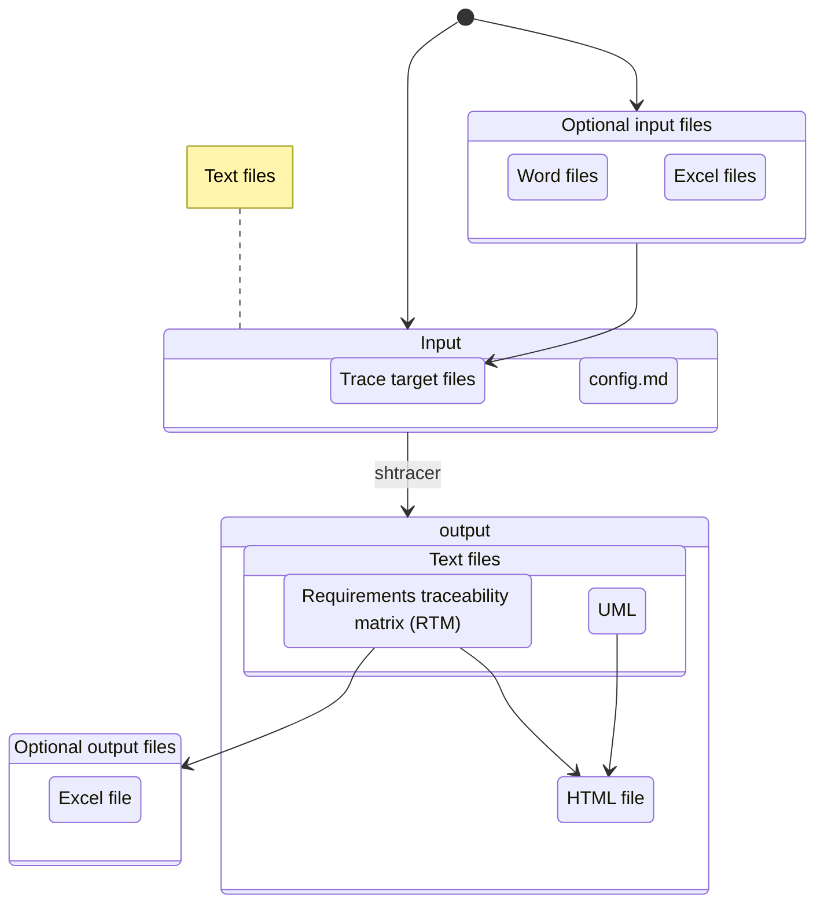
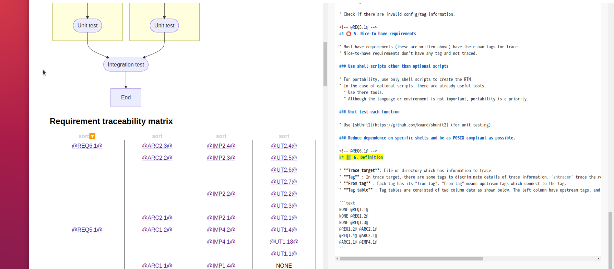

# 🐚 shtracer

[](https://github.com/qq3g7bad/shtracer/actions/workflows/test.yml)
[](LICENSE)
[](https://pubs.opengroup.org/onlinepubs/9699919799/)

Open source traceability matrix generator written in shell scripts.

## 🚩 About

ShellTracer (**shtracer**) is a project for creating a [requirements traceability matrix](https://en.wikipedia.org/wiki/Traceability_matrix) (RTM) easily.

* For maximum extensibility and easy version control, simplify the input/output files as text files.
* For portability, use only shell scripts to create RTMs.



## 📷 Screenshots

### HTML output



### Text output

* Each row traces documents and source files by tags.

```text
@REQ1.2@ @ARC2.1@ @IMP2.1@ @UT1.1@ @IT1.1@
@REQ1.2@ @ARC3.1@ @IMP3.1@ @UT1.2@ @IT1.1@
@REQ1.4@ @ARC2.1@ @IMP2.1@ @UT2.1@ @IT1.1@
```

### UML

* Drawn by Mermaid.


## 🥅 Goal

* Make the requirements traceability matrix (RTM) through markdown formatted text files.
* Use only normal shell scripts and no other programs.

## ⚽ Getting started

1. Open shell.
1. Set the current directory at this repository.
1. Enter the following commands.

```bash
# Change mode
chmod +x ./shtracer

# Optional viewer
chmod +x ./scripts/main/shtracer_viewer.sh

# Read a configuration file and create traceability artifacts (tag table + JSON)
./shtracer ./sample/config.md

# Create a single self-contained HTML report (stdin JSON -> stdout HTML)
./shtracer --json ./sample/config.md | ./scripts/main/shtracer_viewer.sh > ./sample/output/output.html

# Or, generate HTML directly (JSON -> viewer internally)
./shtracer --html ./sample/config.md > ./sample/output/output.html
```

## 🚀 Usage

```text
Usage: shtracer <configfile> [options]

Options:
  -c <old_tag> <new_tag>           Change mode: swap or rename trace target tags
  -v                               Verify mode: detect duplicate or isolated tags
  -t                               Test mode: execute unit tests
  --json                           Export traceability data in JSON format (stdout)
  --html                           Export a single HTML document to stdout
  --summary                        Print traceability summary to stdout (direct links only)
  -h, --help                       Show this help message

Examples:
  1. Normal mode
     $ ./shtracer ./sample/config.md

  2. Generate HTML via viewer (recommended)
     $ ./shtracer --json ./sample/config.md | ./scripts/main/shtracer_viewer.sh > ./sample/output/output.html

  3. Generate HTML directly
     $ ./shtracer --html ./sample/config.md > ./sample/output/output.html

  4. Change mode (swap or rename tags)
     $ ./shtracer -c old_tag new_tag ./sample/config.md

  5. Verify mode (check for duplicate or isolated tags)
     $ ./shtracer -v ./sample/config.md

  6. Test mode
     $ ./shtracer -t

Note:
  - Arguments can be specified in any order.
  - Only one option can be used at a time.

```

### Change tag mode

* Change tags written in all trace targets.
* This function is useful when requirements are updated or revised.

### Verify tag mode

* Verify whether tags are duplicated or isolated.

<details>
<summary>Duplicated</summary>

#### Duplicated

```markdown
<!-- in file1 -->
<!-- @TAG1@ -->
## TEST TARGET 1
```

```markdown
<!-- in file2 -->
<!-- @TAG1@ -->
## TEST TARGET 2
```

</details>

<details>
<summary>Isolated</summary>

#### Isolated

```markdown
<!-- in file1 -->
<!-- @TAG1@ -->
## TEST TARGET 1
```

* Except for this, `@TAG1@` never appears in the trace targets.

</details>

## 🗂️ Features

### Core Traceability

* **Tag-Based Linking**: Connect requirements, architecture, implementation, and tests using simple `@TAG@` syntax in markdown comments
* **Multi-File Tracing**: Trace across multiple markdown files and source code files
* **Verification Mode**: Validate that all tags are properly linked (no orphaned or broken references)
* **Change Mode**: Safely rename/swap tags across your entire project

### Developer-Friendly

* **JSON-First Output**: Structured JSON output via `--json` for integration with other tools
* **Cross-Platform**: POSIX-compliant shell scripts work on Linux, macOS, and Windows (via Git Bash/WSL)
* **Security-Focused**: Removed arbitrary script execution (PRE/POST-EXTRA-SCRIPT) in v0.2.0

For detailed usage and examples, see documents in `./docs/` directory.

## 🌏 Requirements

* **POSIX-Compliant Shell**:
  * shtracer is written in POSIX-compliant shell scripting, ensuring compatibility across a wide range of systems. Although it is commonly used with bash, it should work with any POSIX-compliant shell.
  * **Linux/macOS**:
    * A POSIX shell is typically included by default on Linux and macOS systems.
  * **Windows**:
    * Windows does not include a POSIX-compliant shell natively. To use shtracer on Windows, you can install one of the following:
      * Git Bash
      * MinGW
      * Cygwin

### Optional

* [shUnit2](https://github.com/kward/shunit2) (for unit testing)
* [highlight.js](https://highlightjs.org/) (for syntax highlighting)
* [d3.js](https://d3js.org/) (for showing diagrams)

## 🔧 Development Setup

For contributors and developers working on shtracer, we provide optional Git hooks to maintain code quality.

### Code Quality Tools

Install the following tools for local development (optional but recommended):

```bash
# Install shellcheck
sudo apt-get install shellcheck  # Debian/Ubuntu
brew install shellcheck          # macOS

# Install shfmt v3.8.0 (CI uses this version)
# Install system-wide (recommended)
# go install mvdan.cc/sh/v3/cmd/shfmt@v3.8.0
# or download from https://github.com/mvdan/sh/releases/tag/v3.8.0
```

**Note**: Use shfmt v3.8.0 to match CI formatting checks and avoid false formatting issues.

### Git Hooks

Optional pre-commit hooks are available to automatically check code quality (shellcheck, shfmt) before commits. These hooks are optional for local development as all checks are also enforced in CI.

For installation and usage, see [.git-hooks/README.md](.git-hooks/README.md).

## 📝 Contribution

* RTM is important not only in software field but also in other fields, so that contributions from other fields are welcomed.
* Consider using [conventional commits](https://www.conventionalcommits.org/en/v1.0.0/) rules for creating explicit and meaningful commit messages.

## ✅ TODO

### High Priority

* Improve HTML output styling: Apply nice colorschemes that are colorblind-friendly
* Make a cross-reference table for easy reference
* Export all trace data in Markdown format.

### Future Enhancements

* Use OR condition in the extension filter
* Support Excel/CSV export formats
