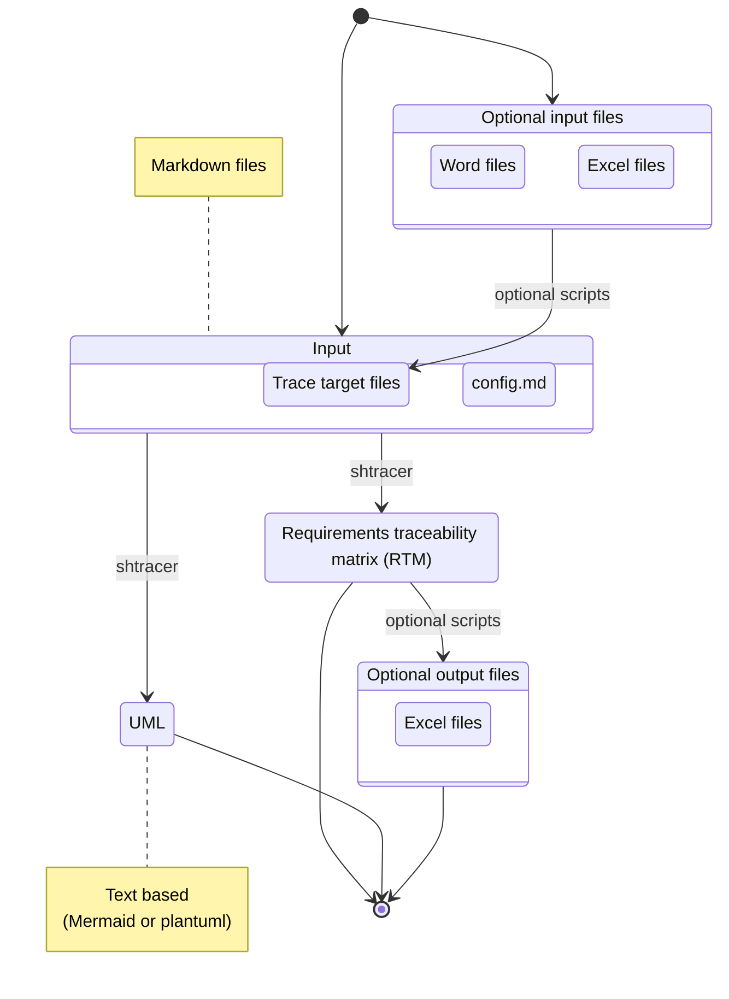

# 🐚 shtracer

Open source traceability matrix generator written in shell scripts.

## 🚩 About

ShellTracer (**shtracer**) is a project for creating the [requirements traceability matrix](https://en.wikipedia.org/wiki/Traceability_matrix) (RTM) easily.

* For maximum extensibility and easy version control, simplify the input/output files as text files.
* For portability, use only shell scripts to create the RTM.



## 📷 Screenshots

### UML


### Text based RTM

* Each row traces documents and source files by tags.

```text
@REQ1.2@ @ARC2.1@ @IMP2.1@ @UT1.1@ @IT1.1@
@REQ1.2@ @ARC3.1@ @IMP3.1@ @UT1.2@ @IT1.1@
@REQ1.4@ @ARC2.1@ @IMP2.1@ @UT2.1@ @IT1.1@
```

## 🥅 Goal

* Make the requirements traceability matrix (RTM) through markdown formatted text files.
* Use only normal shell scripts and no other programs.

## ⚽ Getting started

1. Open bash.
1. Set the current directory at this repository.
1. Enter the following commands.

```bash
# Change mode
chmod +x ./shtracer

# Read a configuration file and create a traceability matrix
./shtracer ./sample/config.md
```

## 🚀 Usage

```text
Usage: shtracer <configfile> [options]

Options:
  -c <before_tag> <after_tag>      Change mode: swap or rename trace target tags
  -v                               Verify mode: detect duplicate or isolated tags
  -h, --help                       Show this help message

Examples:
  1. Change mode (swap or rename tags).
     $ shtracer sample/config.md

  2. Change mode (swap or rename tags)
     $ shtracer sample/config.md -c old_tag new_tag.

  3. Verify mode (check for duplicate or isolated tags).
     $ shtracer sample/config.md -v

Note:
  - The <configfile> argument must always be specified before options.
  - The -o option is optional and can be used with both change mode and verify mode.

Version:
      - 0.0.1
```

### Change tag mode

* Change tags written in all trace targets.
* This function is useful when requirements are updated or revised.

### Verify tag mode

* Verify whether tags are duplicated or isolated.

<details>
<summary>Duplicated</summary>

#### Duplicated

```markdown
<!-- in file1 -->
<!-- @TAG1@ -->
## TEST TARGET 1
```

```markdown
<!-- in file2 -->
<!-- @TAG1@ -->
## TEST TARGET 2
```

</details>

<details>
<summary>Isolated</summary>

#### Isolated

```markdown
<!-- in file1 -->
<!-- @TAG1@ -->
## TEST TARGET 1
```

* Except for this, `@TAG1@` never appears in the trace targets.

</details>

## 🗂️ Features

* Create traceability markdown files from following input files.
  * Markdown files which include contents to trace.
  * These contents are indexed by their own IDs.
  * Connections between files are specified by IDs.
  * These IDs are written in each markdown file as comment blocks.
* (Optional) Use markdown files as intermediate products.
  * Create intermediate markdown files from other file format by using some scripts.
  * Create non-markdown output files by using some scripts.

For details, see documents in `./docs/` directory.

## 🌏 Requirements

* bash (git-bash for Windows)
* [shUnit2](https://github.com/kward/shunit2) (for unit testing)

## 📝 Contribution

* RTM is important not only in software field but also in other fields, so that contributions from other fields are welcomed.
* Consider using [conventional commits](https://www.conventionalcommits.org/en/v1.0.0/) rules for creating explicit and meaningful commit messages.
