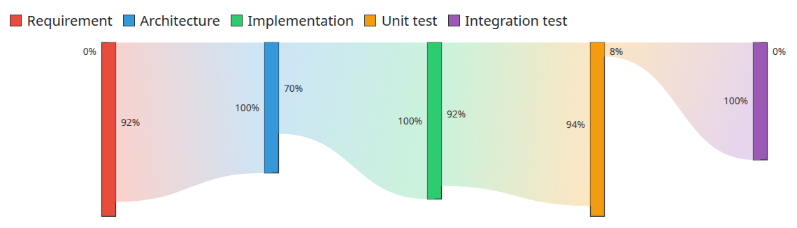
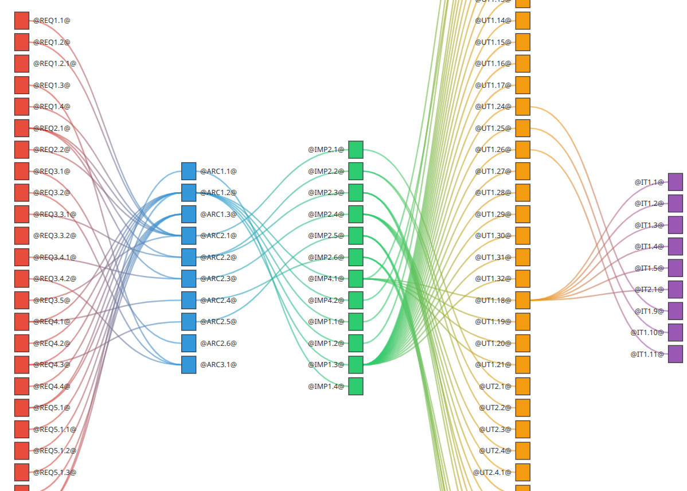
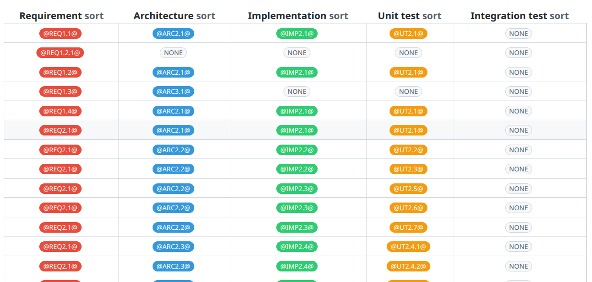

# 🐚 shtracer

[](https://github.com/qq3g7bad/shtracer/actions/workflows/test.yml)
[](LICENSE)
[](https://pubs.opengroup.org/onlinepubs/9699919799/)

**Zero-dependency requirements traceability for modern development workflows**

Track requirements → architecture → implementation → tests using simple markdown tags. Built with pure POSIX shell for maximum portability and CI/CD integration.

---

## 🎯 Why shtracer?

Traditional requirements traceability tools are **heavy, proprietary, and hard to integrate** into modern development workflows. shtracer takes a different approach:

### ✨ Key Benefits

**🔗 CI/CD Native**
- **Structured JSON output** (`--json`) for seamless pipeline integration
- Parse, validate, and enforce traceability in your CI checks
- No databases, no servers—just pipe JSON to any tool you want

**📦 Zero Dependencies**
- Pure POSIX shell—works on Linux, macOS, Windows (Git Bash/WSL)
- No Python, Node.js, or runtime environments required
- Clone and run: `./shtracer ./sample/config.md`

**📝 Developer-Friendly**
- Write requirements in **plain Markdown**—no proprietary formats
- Simple `@TAG@` syntax in comments: `<!-- @REQ-001@ -->`
- Version control friendly: diffs are readable, merges are clean

**🔄 Automated Maintenance**
- **Change mode**: Rename tags across entire codebase in one command
- **Verify mode**: Detect orphaned or duplicate tags automatically
- Keep your traceability matrix accurate as requirements evolve

---

## 🚀 Quick Start

```bash
# Clone and run (no installation needed)
git clone https://github.com/qq3g7bad/shtracer.git
cd shtracer
chmod +x ./shtracer

# Generate traceability matrix
./shtracer ./sample/config.md

# Output structured JSON for CI/CD
./shtracer --json ./sample/config.md > traceability.json

# Generate interactive HTML report
./shtracer --html ./sample/config.md > report.html
```

---

## 📖 How It Works

### 1. Tag your documents and code

**requirements.md**
```markdown
<!-- @REQ-001@ -->
## User Authentication
Users must be able to log in with email and password.
```

**architecture.md**
```markdown
<!-- @REQ-001@ @ARCH-101@ -->
## Authentication Service
Implements OAuth 2.0 with JWT tokens.
```

**auth.sh**
```bash
# @ARCH-101@ @IMPL-201@
function authenticate_user() {
    # Implementation
}
```

**auth_test.sh**
```bash
# @IMPL-201@ @TEST-301@
test_authenticate_user() {
    # Test implementation
}
```

### 2. Generate traceability matrix

```bash
./shtracer --json ./sample/config.md
```

**Output (JSON)**:
```json
{
  "traces": [
    {
      "chain": ["@REQ-001@", "@ARCH-101@", "@IMPL-201@", "@TEST-301@"],
      "files": [
        "requirements.md",
        "architecture.md",
        "auth.sh",
        "auth_test.sh"
      ]
    }
  ]
}
```

### 3. Integrate with CI/CD

```yaml
# .github/workflows/traceability.yml
- name: Validate traceability
  run: |
    ./shtracer --json config.md | jq '.traces[] | select(.chain | length < 4)' > orphaned.json
    if [ -s orphaned.json ]; then
      echo "❌ Found incomplete traceability chains"
      exit 1
    fi
```

---

## 📷 Screenshots

### Interactive HTML Report

#### Coverage



#### Full trace



#### Sortable matrix



*Visualize requirement flows from requirements to tests. Click badges to jump to source files.*

### Text Output (CI-friendly)

```text
@REQ1.2@ @ARC2.1@ @IMP2.1@ @UT1.1@ @IT1.1@
@REQ1.2@ @ARC3.1@ @IMP3.1@ @UT1.2@ @IT1.1@
@REQ1.4@ @ARC2.1@ @IMP2.1@ @UT2.1@ @IT1.1@
```

---

## ⚙️ Usage

### Basic Commands

```bash
# Generate traceability artifacts (tag table + JSON files)
./shtracer ./sample/config.md

# Export structured JSON to stdout (CI/CD friendly)
./shtracer --json ./sample/config.md

# Generate standalone HTML report
./shtracer --html ./sample/config.md > report.html

# Rename tags across entire project
./shtracer -c @OLD-TAG@ @NEW-TAG@ ./sample/config.md

# Verify traceability (detect orphaned/duplicate tags)
./shtracer -v ./sample/config.md

# Run unit tests
./shtracer -t
```

### Configuration File Format

The `config.md` file defines which files to trace and how to organize traceability links. It uses markdown format with specific section headers that correspond to traceability levels (Requirements → Architecture → Implementation → Tests).

**Example `config.md`:**

```markdown
# Traceability Configuration

## Requirements
- ./docs/requirements.md
- ./docs/use_cases/*.md

## Architecture
- ./docs/architecture.md
- ./docs/design/*.md

## Implementation
- ./src/**/*.sh
- ./src/**/*.py

## Tests
- ./tests/**/*_test.sh
- ./tests/integration/**/*.sh
```

**Key Points:**
- Section headers (`## Requirements`, `## Architecture`, etc.) define traceability levels
- Supports glob patterns (`**/*.sh`) for matching multiple files
- Supports multiple files per section
- Paths are relative to the config file location

For a complete example, see [`./sample/config.md`](./sample/config.md).

---

## 🔧 Command Reference

```text
Usage: shtracer <configfile> [options]

Options:
  --json                           Export traceability data as JSON to stdout (CI/CD ready)
  --html                           Generate standalone HTML report to stdout
  --summary                        Print traceability summary (direct links only)
  -c <old_tag> <new_tag>           Rename/swap tags across all traced files
  -v                               Verify mode: detect duplicate or orphaned tags
  -t                               Run unit tests
  -h, --help                       Show this help message

Examples:
  # Generate traceability matrix
  ./shtracer ./sample/config.md

  # CI/CD pipeline integration
  ./shtracer --json ./sample/config.md | jq '.traces'

  # Create HTML report
  ./shtracer --html ./sample/config.md > report.html

  # Refactor: rename tags across entire project
  ./shtracer -c @OLD-001@ @NEW-001@ ./sample/config.md

  # Quality check: find broken traceability
  ./shtracer -v ./sample/config.md
```

---

## 💡 Use Cases

### 1️⃣ **Continuous Compliance Validation**

Enforce traceability in your CI pipeline with **specific exit codes**:

```yaml
# GitHub Actions example
jobs:
  traceability:
    runs-on: ubuntu-latest
    steps:
      - uses: actions/checkout@v3

      - name: Verify traceability
        run: |
          chmod +x ./shtracer

          # Run verification mode
          ./shtracer -v config.md
          exit_code=$?

          # Handle specific error types
          case $exit_code in
            0)
              echo "✅ All traceability checks passed"
              ;;
            20)
              echo "❌ Found isolated tags (no downstream references)"
              exit 1
              ;;
            21)
              echo "❌ Found duplicate tags"
              exit 1
              ;;
            22)
              echo "❌ Found both isolated and duplicate tags"
              exit 1
              ;;
            *)
              echo "❌ Verification failed with exit code $exit_code"
              exit 1
              ;;
          esac

      - name: Check JSON output for completeness
        run: |
          ./shtracer --json config.md > trace.json

          # Ensure all requirements are traced to tests
          orphaned=$(jq '[.traces[] | select(.chain | length < 4)] | length' trace.json)
          if [ "$orphaned" -gt 0 ]; then
            echo "❌ Found $orphaned incomplete trace chains"
            exit 1
          fi
```

**Available Exit Codes for CI/CD:**
- `0` - Success
- `1` - Invalid usage or arguments
- `2` - Config file not found
- `10` - Failed to extract tags
- `11` - Failed to create tag table
- `12` - Failed to generate JSON
- `20` - Found isolated tags (verify mode)
- `21` - Found duplicate tags (verify mode)
- `22` - Found both isolated and duplicate tags (verify mode)

### 2️⃣ **Automated Documentation**

Generate up-to-date traceability reports on every commit:

```bash
# In your CI/CD pipeline
./shtracer --html config.md > docs/traceability.html
git add docs/traceability.html
git commit -m "docs: update traceability matrix [skip ci]"
```

### 3️⃣ **Requirements Refactoring (Change Mode)**

Safely rename requirements across your entire project:

```bash
# Rename REQ-001 to REQ-AUTH-001 everywhere
./shtracer -c @REQ-001@ @REQ-AUTH-001@ config.md
```

**Use cases:**
- Renaming requirements during refactoring
- Swapping test case identifiers
- Reorganizing architecture tags

### 4️⃣ **Quality Audits (Verify Mode)**

Detect traceability issues before they become problems:

```bash
# Run verification mode
./shtracer -v config.md
```

**Detects:**

<details>
<summary><strong>Duplicate Tags</strong></summary>

```markdown
<!-- file1.md -->
<!-- @REQ-001@ -->
## Feature A

<!-- file2.md -->
<!-- @REQ-001@ -->  <!-- ❌ Duplicate! -->
## Feature B
```

</details>

<details>
<summary><strong>Orphaned Tags</strong></summary>

```markdown
<!-- requirements.md -->
<!-- @REQ-999@ -->
## Isolated Requirement

<!-- ⚠️  No references to @REQ-999@ in architecture, implementation, or tests -->
```

</details>

---

## 🔧 JSON Output Schema

Perfect for CI/CD and custom tooling:

```json
{
  "config_path": "config.md",
  "nodes": [
    {
      "id": "@REQ-001@",
      "file": "docs/requirements.md",
      "line": 15,
      "trace_target": "Requirements"
    },
    {
      "id": "@ARCH-101@",
      "file": "docs/architecture.md",
      "line": 42,
      "trace_target": "Architecture"
    }
  ],
  "chains": [
    {
      "upstream": "@REQ-001@",
      "downstream": "@ARCH-101@"
    }
  ]
}
```

---

## 🛠️ Development & Testing

### System Requirements

**POSIX-Compliant Shell** (bash, dash, zsh, etc.)
- ✅ Linux/macOS: Built-in by default
- ✅ Windows: Git Bash, WSL, MinGW, or Cygwin

**Optional Dependencies**
- [shUnit2](https://github.com/kward/shunit2) - Unit testing framework
- [shellcheck](https://www.shellcheck.net/) - Shell script linter
- [shfmt](https://github.com/mvdan/sh) - Shell script formatter

### Running Tests

```bash
# Run all unit tests (66 unit tests)
./shtracer -t

# Run integration tests (32 tests)
./scripts/test/integration/shtracer_integration_test.sh

# Lint shell scripts
shellcheck ./shtracer ./scripts/main/*.sh

# Format shell scripts (use v3.8.0 to match CI)
shfmt -w -i 2 -ci -bn ./shtracer ./scripts/main/*.sh
```

**Test Coverage:**
- ✅ Tag extraction and chain building
- ✅ JSON/HTML generation
- ✅ Change mode (tag renaming)
- ✅ Verify mode (duplicate/orphan detection)
- ✅ Refactoring helpers (POSIX compliance)
- ✅ CI/CD integration workflows

### Git Hooks (Optional)

Pre-commit hooks for code quality are available (optional for local development, enforced in CI):

```bash
# Enable git hooks
./scripts/setup-hooks.sh  # If available

# Or manually link
ln -s ../../.git-hooks/pre-commit .git/hooks/pre-commit
```

See [`.git-hooks/README.md`](.git-hooks/README.md) for details.

---

## 📚 Documentation

- **[Requirements](./docs/01_requirements.md)** - Detailed feature specifications
- **[Architecture](./docs/02_architecture.md)** - System design and components
- **[Sample Configuration](./sample/config.md)** - Example traceability setup

---

## 🤝 Contributing

We welcome contributions from **all domains**—not just software! Requirements traceability is valuable in:
- 🏗️ Engineering & manufacturing
- 🏥 Healthcare & medical devices
- ✈️ Aerospace & defense
- 📜 Regulatory compliance

### Contribution Guidelines

- Use [Conventional Commits](https://www.conventionalcommits.org/) for clear commit messages
- Run `./shtracer -t` before submitting PRs
- Update documentation for new features

---

## 🗺️ Roadmap

### Current Focus
- [ ] Cross-reference table generation
- [ ] Markdown export format
- [ ] Enhanced JSON schema with metadata

### Future Enhancements
- [ ] Excel/CSV export formats
- [ ] Colorblind-friendly HTML themes
- [ ] OR conditions in file extension filters
- [ ] GitLab/Bitbucket CI examples

---

## 📄 License

This project is licensed under the [MIT License](LICENSE).

---

## 🌐 Learn More

- 📖 [Requirements Traceability Matrix (Wikipedia)](https://en.wikipedia.org/wiki/Traceability_matrix)
- 🐚 [POSIX Shell Specification](https://pubs.opengroup.org/onlinepubs/9699919799/)
- 🔗 [GitHub Repository](https://github.com/qq3g7bad/shtracer)
