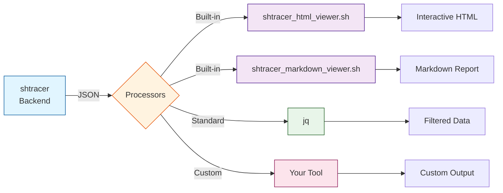

# 🐚 shtracer

[](https://github.com/qq3g7bad/shtracer/actions/workflows/test.yml)
[](LICENSE)
[](https://pubs.opengroup.org/onlinepubs/9699919799/)

**Zero-dependency requirements traceability for modern development workflows**

Track requirements → architecture → implementation → tests using simple markdown tags. Built with pure POSIX shell for maximum portability and CI/CD integration.

---

## 🎯 Why shtracer?

Traditional requirements traceability tools are **heavy, proprietary, and hard to integrate** into modern development workflows. shtracer takes a different approach:

### ✨ Key Benefits

**🔗 CI/CD Native**

- **Structured JSON output** for seamless pipeline integration
- Parse, validate, and enforce traceability in your CI checks
- No databases, no servers—just pipe JSON to any tool you want

**📦 Zero Dependencies**

- Pure POSIX shell—works on Linux, macOS, Windows (Git Bash/WSL)
- No Python, Node.js, or runtime environments required

**📝 Developer-Friendly**

- Write requirements in **plain Markdown**—no proprietary formats
- Simple tag syntax in comments: e.g. `<!-- @REQ-001@ -->` (Tag syntax is written in the config file)
- Version control friendly: diffs are readable, merges are clean

**🔄 Automated Maintenance**

- **Change mode**: Rename tags across entire codebase in one command
- **Verify mode**: Detect orphaned or duplicate tags automatically
- Keep your traceability matrix accurate as requirements evolve

---

## 🚀 Quick Start

```bash
# Clone and run (no installation needed)
git clone https://github.com/qq3g7bad/shtracer.git
cd shtracer
chmod +x ./shtracer

# Generate traceability matrix
./shtracer ./sample/config.md

# Output structured JSON for CI/CD
./shtracer ./sample/config.md > traceability.json

# Generate interactive HTML report
./shtracer --html ./sample/config.md > report.html

# Generate markdown report
./shtracer --markdown ./sample/config.md > report.md
```

---

## 📖 How It Works

### 1. Tag your documents and code

**requirements.md**

```markdown
<!-- @REQ-001@ -->
## User Authentication
Users must be able to log in with email and password.
```

**architecture.md**

```markdown
<!-- @ARCH-101@ (FROM: @REQ-001@) -->
## Authentication Service
Implements OAuth 2.0 with JWT tokens.
```

**auth.sh**

```bash
# @IMPL-201@ (FROM: @ARCH-101@)
function authenticate_user() {
    # Implementation
}
```

**auth_test.sh**

```bash
# @TEST-301@ (FROM: @IMPL-201@)
test_authenticate_user() {
    # Test implementation
}
```

### 2. Generate traceability matrix

```bash
./shtracer ./sample/config.md
```

**Output (JSON snippet)**:

```json
{
  "metadata": {
    "version": "0.1.3",
    "generated": "2025-12-27T03:57:27Z",
    "config_path": "/path/to/config.md"
  },
  "files": [
    {"layer": "Requirement", "file": "requirements.md", "total": 10, "upstream_count": 0, "downstream_count": 8, "upstream_percent": 0, "downstream_percent": 80, "version": "git:abc123"},
    {"layer": "Architecture", "file": "architecture.md", "total": 5, "upstream_count": 5, "downstream_count": 3, "upstream_percent": 100, "downstream_percent": 60, "version": "git:def456"}
  ],
  "nodes": [
    {"id": "@REQ-001@", "description": "User authentication", "line": 15, "file_id": 0},
    {"id": "@ARCH-101@", "description": "Auth service design", "line": 42, "file_id": 1}
  ],
  "chains": [
    ["@REQ-001@", "@ARCH-101@", "@IMPL-201@", "@TEST-301@", "NONE"]
  ],
  "links": [
    {"source": "@REQ-001@", "target": "@ARCH-101@"}
  ]
}
```

### 3. (Optioanal) Interactive HTML Report

#### Coverage


#### Full trace


#### Sortable matrix with interactive tabs


---

## ⚙️ Usage

### Basic Commands

```bash
# Generate traceability artifacts (tag table + JSON files)
./shtracer ./sample/config.md

# Generate standalone HTML report (Method 1: Use option)
./shtracer --html ./sample/config.md > report.html
# Generate standalone HTML report (Method 2: Use viewer)
./shtracer ./sample/config.md | ./scripts/main/shtracer_html_viewer.sh > report.html

# Generate markdown report (Method 1: Use option)
./shtracer --markdown ./sample/config.md > report.md
# Generate markdown report (Method 2: Use viewer)
./shtracer ./sample/config.md | ./scripts/main/shtracer_markdown_viewer.sh > report.md

# Rename tags across entire project
./shtracer -c @OLD-TAG@ @NEW-TAG@ ./sample/config.md

# Verify traceability (detect orphaned/duplicate tags)
./shtracer -v ./sample/config.md

# Run unit tests
./shtracer -t
```

### Configuration File Format

The `config.md` file defines which files to trace and how to organize traceability links. Each section header defines a traceability level (e.g., `## Requirement`, `## Architecture`), and properties specify paths, tag patterns, and filters.

**Quick Example:**

```markdown
## Requirement
* **PATH**: "./docs/requirements.md"
* **TAG FORMAT**: `@REQ[0-9\.]+@`
* **TAG LINE FORMAT**: `<!--.*-->`

## Implementation
* **PATH**: "./src/"
* **EXTENSION FILTER**: "*.sh"
* **TAG FORMAT**: `@IMP[0-9\.]+@`
* **TAG LINE FORMAT**: `#.*`
```

**Key Properties:**

- `**PATH**`: File or directory path (relative to config file)
- `**TAG FORMAT**`: ERE regex pattern for tags (in backticks)
- `**TAG LINE FORMAT**`: ERE pattern for lines containing tags (`#.*` for shell, `<!--.*-->` for markdown)
- `**EXTENSION FILTER**`: Optional file extension filter (e.g., `*.sh`)
- `**IGNORE FILTER**`: Optional ignore pattern using `|` for multiple conditions

📖 **See [`./sample/config.md`](./sample/config.md) for a complete working example.**

---

## 🔧 Command Reference

```text
Usage: shtracer <configfile> [options]

Options:
  --html                           Generate standalone HTML report to stdout
  --markdown                       Generate markdown report to stdout
  --summary                        Print traceability summary (direct links only)
  -c <old_tag> <new_tag>           Rename/swap tags across all traced files
  -v                               Verify mode: detect duplicate or orphaned tags
  -t                               Run unit tests
  -h, --help                       Show this help message

Examples:
  # Generate traceability matrix
  ./shtracer ./sample/config.md

  # CI/CD pipeline integration
  ./shtracer ./sample/config.md | jq '.chains'

  # Create HTML report
  ./shtracer --html ./sample/config.md > report.html

  # Refactor: rename tags across entire project
  ./shtracer -c @OLD-001@ @NEW-001@ ./sample/config.md

  # Quality check: find broken traceability
  ./shtracer -v ./sample/config.md
```

---

## 💡 Use Cases

### Available Exit Codes for CI/CD

- `0` - Success
- `1` - Invalid usage or arguments
- `2` - Config file not found
- `10` - Failed to extract tags
- `11` - Failed to create tag table
- `12` - Failed to generate JSON
- `20` - Found isolated tags (verify mode)
- `21` - Found duplicate tags (verify mode)
- `22` - Found both isolated and duplicate tags (verify mode)

### Automated Documentation

Generate up-to-date traceability reports on every commit:

```bash
# In your CI/CD pipeline
./shtracer --html config.md > docs/traceability.html
git add docs/traceability.html
git commit -m "docs: update traceability matrix [skip ci]"
```

---

## 🔄 Pipeline Architecture & Custom Integration

### Architecture Overview



**Key Concepts:**

- **shtracer core** = Backend (generates JSON only)
- **Viewers** = Independent filters (consume JSON from stdin/file)
- **You** = Can build custom tools using the JSON API

### Using Viewers as Filters

Viewers can be invoked via flags (convenience) or as standalone filters (composability):

```bash
# Method 1: Using built-in flags (convenience)
./shtracer --html ./sample/config.md > report.html
./shtracer --markdown ./sample/config.md > report.md

# Method 2: Explicit pipeline (composability)
./shtracer ./sample/config.md | ./scripts/main/shtracer_html_viewer.sh > report.html
./shtracer ./sample/config.md | ./scripts/main/shtracer_markdown_viewer.sh > report.md

# Method 3: Custom processing before viewing
./shtracer ./sample/config.md | jq '.nodes |= map(select(.trace_target == ":Requirement"))' | ./scripts/main/shtracer_html_viewer.sh > filtered.html
```

---

## 🛠️ Development & Testing

### System Requirements

**POSIX-Compliant Shell** (bash, dash, zsh, etc.)

- ✅ Linux/macOS: Built-in by default
- ✅ Windows: Git Bash, WSL, MinGW, or Cygwin

**Optional Dependencies**

- [shUnit2](https://github.com/kward/shunit2) - Unit testing framework
- [shellcheck](https://www.shellcheck.net/) - Shell script linter
- [shfmt](https://github.com/mvdan/sh) - Shell script formatter

### Running Tests

```bash
# Run all unit tests (66 unit tests)
./shtracer -t

# Run integration tests (32 tests)
./scripts/test/integration/shtracer_integration_test.sh

# Lint shell scripts
shellcheck ./shtracer ./scripts/main/*.sh

# Format shell scripts (use v3.8.0 to match CI)
shfmt -w -i 2 -ci -bn ./shtracer ./scripts/main/*.sh
```

---

## 📄 License

This project is licensed under the [MIT License](LICENSE).

---

## 🌐 Learn More

- 📖 [Requirements Traceability Matrix (Wikipedia)](https://en.wikipedia.org/wiki/Traceability_matrix)
- 🐚 [POSIX Shell Specification](https://pubs.opengroup.org/onlinepubs/9699919799/)
- 🔗 [GitHub Repository](https://github.com/qq3g7bad/shtracer)
