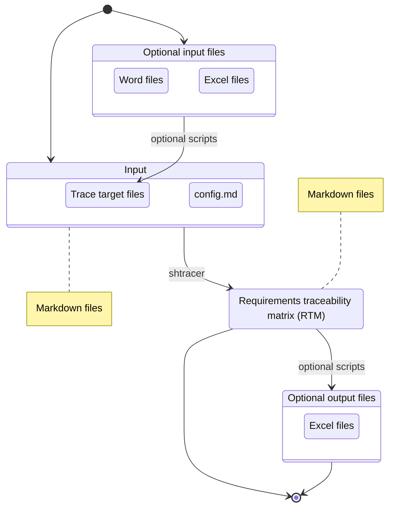

# 🏡 Architecture & Detailed design

## 📂 Project layout

```text
├── shtracer              Entry point of this project
├── docs/                 Documents for development
├── sample                Sample config data
└── scripts               Scripts for `shtracer`
    ├── main              Main shell scripts (and helper functions)
    ├── optional          Optional shell/python scripts
    └── test              For testing
        └── shunit2       Testing framework introduced by git submodule
```

### Workflow



<!-- @ARC1.1@ (FROM: @REQ5.1@) -->
## 🔵 `shtracer`

<a id="tag-123"></a>

* Entry point of this project.

```bash
# Change mode
chmod +x ./shtracer

# Read a configuration file and create a traceability matrix
./shtracer ./sample/config.md
```

<!-- @ARC1.2@ (FROM: @REQ4.1@, @REQ4.2@, @REQ4.3@, @REQ5.1@) -->
### Utility

The `shtracer` file includes utility functions.

* Initialize environment
* Error and exit
* Print usage
* Parse arguments
* Load helper functions
* Main routine

## 📂 scripts/main/

### 📄 `shtracer_func.sh`

<!-- @ARC2.1@ (FROM: @REQ1.1@, @REQ1.2@, @REQ1.4@, @REQ2.1@, @REQ6.1@) -->
#### Check the config file

* Read configuration file.
* Extract each trace target information in one line. Each line has the following items.

column | content
------ | --------------------
1      | (mandatory) trace target title
2      | (mandatory) path (to directory or file)
3      | (optional) extention with wildcard (BRE is acceptable)
4      | (optional) description
5      | (mandatory) tag format (for serching tags written in BRE)
6      | (mandatory) tag line format (for serching lines including tags written in BRE)
7      | (optional) tag-title offset (how many lines away from each tags, default: 1)

<!-- @ARC2.2@ (FROM: @REQ2.1@, @REQ3.1.1@, @REQ3.1.2@, @REQ6.1@) -->
#### Make tag table

* Read trace targets.
  * Get each tag and its "from tags".
  * A tag table is consisted of two column data as shown below.

```text
NONE @REQ1.1@
NONE @REQ1.2@
NONE @REQ1.3@
@REQ1.2@ @ARC2.1@
@REQ1.4@ @ARC2.1@
@ARC2.1@ @IMP1.1@
```

<!-- @ARC2.3@ (FROM: @REQ2.1@, @REQ3.2.1@, @REQ6.1@) -->
#### Join tag table

* Connect tag tables from right direction.

```text
@REQ1.1@ @ARC2.1@ @IMP2.1@ @TST1.1@
@REQ1.2@ @ARC2.1@ @IMP2.1@ @TST1.2@
@REQ2.1@ @ARC2.1@ @IMP2.1@ @TST1.3@
@REQ2.1@ @ARC2.2@ @IMP2.2@ @TST2.1@
```

<!-- @ARC2.4@ (FROM: @REQ4.1@) -->
#### Swap tags

* Swap tags in all trace targets

<!-- @ARC2.5@ (FROM: @REQ4.3@) -->
#### Verify tag information

The following cases are invalid.

* [ ] From tags that have no upstream tags.
* [ ] Duplicated tags.

<!-- @ARC3.1@ (FROM: @REQ1.3@, @REQ3.2.2@) -->
### 📄 `shtracer_uml.sh`

* Output text formatted UML data (e.g. plantuml, mermaid) as written below.


<!-- @ARC4.1@ (FROM: @REQ2.2@, @REQ3.3@) -->
## 📂 scripts/optional/

* Not implemented
