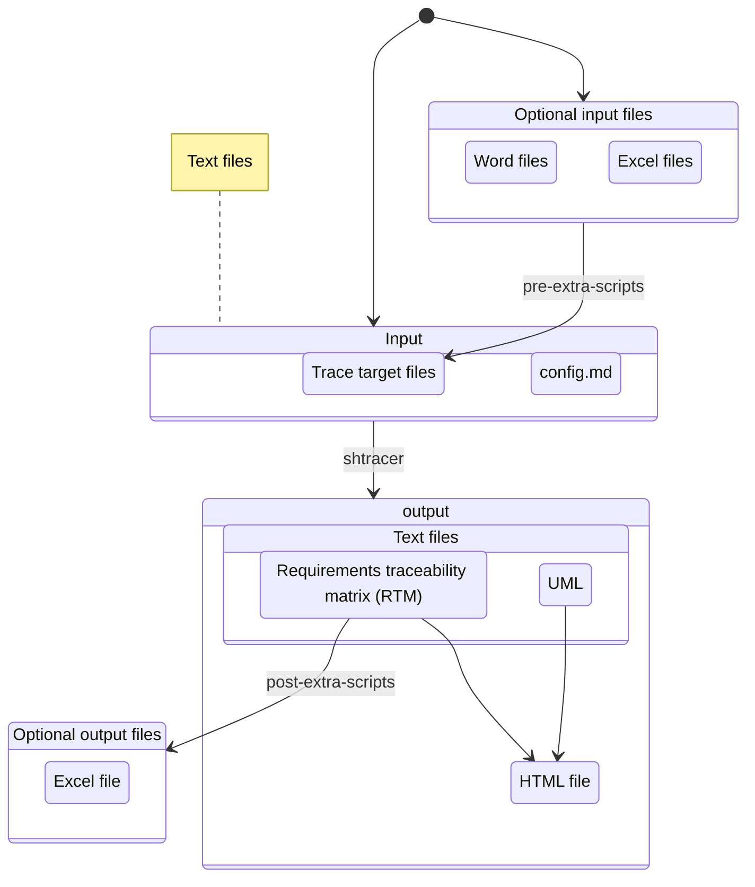
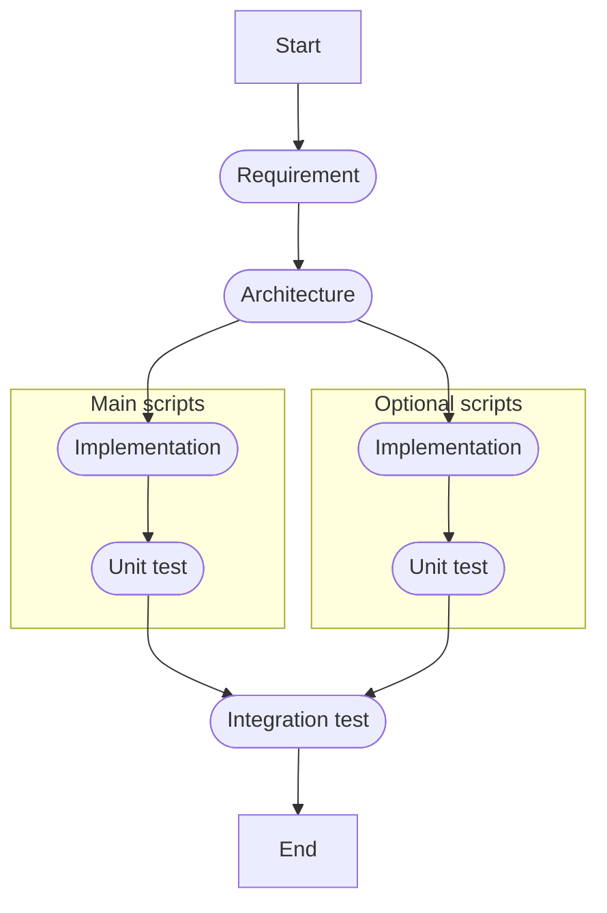

# 🏡 Architecture & Detailed design

## 📂 Project layout

```text
├── shtracer              Entry point of this project
├── docs/                 Documents for development
├── sample                Sample config data
└── scripts               Scripts for `shtracer`
    ├── main              Main shell scripts (and helper functions)
    └── test              For testing
        └── shunit2       Testing framework introduced by git submodule
```

### Workflow



<!-- @ARC1.1@ (FROM: @REQ5.1@) -->
## 🔵 `shtracer`

<a id="tag-123"></a>

* Entry point of this project.

```bash
# Change mode
chmod +x ./shtracer

# Read a configuration file and create a traceability matrix
./shtracer ./sample/config.md
```

<!-- @ARC1.2@ (FROM: @REQ4.1@, @REQ4.2@, @REQ4.3@, @REQ5.1@) -->
### Utility

The `shtracer` file includes utility functions.

* Initialize environment
* Error and exit
* Print usage
* Parse arguments
* Load helper functions
* Main routine

## 📂 scripts/main/

### 📄 `shtracer_func.sh`

<!-- @ARC2.1@ (FROM: @REQ1.1@, @REQ1.2@, @REQ1.4@, @REQ2.1@, @REQ2.2@, @REQ3.3@) -->
#### Check the config file

* Read configuration file.
* Extract each trace target information in one line. Each line has the following items.

Implementation is divided into two helper functions:

##### Remove comments from config markdown

* Remove HTML comment blocks from the configuration markdown file.
* Preserve comment blocks surrounded by backticks (exceptions for code examples).
* Remove empty lines and normalize whitespace.
* Strip markdown bold syntax from field names.

##### Convert cleaned config to table format

* Parse markdown heading hierarchy and convert to colon-separated titles (e.g., `Heading1:Heading1.1:Heading1.1.1`).
* Extract field-value pairs from the cleaned markdown content.
* Output tab-separated table with 10 columns per trace target configuration.

column | optional  | content                                                              | quotation
------ | --------- | -------------------------------------------------------------------- | -------
1      | mandatory | trace target title                                                   | "
2      | mandatory | path (to directory or file from your config file)                    | "
3      | optional  | extension with wildcard (BRE is acceptable)                          | "
4      | optional  | ignore filter (you can use wildcards)                                | "
5      | optional  | description                                                          | "
6      | mandatory | tag format (for searching tags written in BRE)                       | `
7      | mandatory | tag line format (for searching lines including tags written in BRE) | `
8      | optional  | tag-title offset (how many lines away from each tag, default: 1)     | none
9      | optional  | pre-extra-script                                                     | `
10     | optional  | post-extra-script                                                    | `

<!-- @ARC2.2@ (FROM: @REQ2.1@, @REQ3.1.1@) -->
#### Make tag table

* Read trace targets.
  * Get each tag and its "from tags".
  * A tag table consists of two-column data as shown below.

Implementation is divided into three helper functions:

##### Validate config file input

* Validate that the config output file exists.
* Convert relative paths to absolute paths for consistent file handling.
* Return the absolute path or exit with an error if the file does not exist.

##### Discover target files from config

* Parse the config table to extract path and extension filter information.
* Handle both file and directory paths.
* Build `find` commands for directory traversal with extension filters.
* Support multiple extension filters separated by `|` (pipe).
* Support ignore filters to exclude specific files or directories.
* Return a sorted, unique list of files to process.

##### Extract tags from discovered files

* Process each discovered file to extract tags.
* Use AWK to parse files line by line, searching for tag patterns.
* Extract tag IDs, FROM tags (upstream references), and associated titles.
* Handle TAG-TITLE OFFSET to find the correct title line relative to each tag.
* Output tag information with file paths and line numbers.

```text
NONE @REQ1.1@
NONE @REQ1.2@
NONE @REQ1.3@
@REQ1.2@ @ARC2.1@
@REQ1.4@ @ARC2.1@
@ARC2.1@ @IMP4.1@
```

<!-- @ARC2.3@ (FROM: @REQ2.1@, @REQ3.2.1@) -->
#### Join tag table

* Connect tag tables from right direction.

```text
@REQ1.1@ @ARC2.1@ @IMP2.1@ @TST1.1@
@REQ1.2@ @ARC2.1@ @IMP2.1@ @TST1.2@
@REQ2.1@ @ARC2.1@ @IMP2.1@ @TST1.3@
@REQ2.1@ @ARC2.2@ @IMP2.2@ @TST2.1@
```

<!-- @ARC2.4@ (FROM: @REQ4.1@) -->
#### Swap tags

* Swap tags in all trace targets

<!-- @ARC2.5@ (FROM: @REQ4.3@) -->
#### Verify tag information

The following cases are invalid.

* [ ] From tags that have no upstream tags.
* [ ] Duplicated tags.

<!-- @ARC3.1@ (FROM: @REQ1.3@, @REQ3.2.2@) -->
### 📄 `shtracer_viewer.sh`

* Generate an HTML visualization from shtracer JSON (stdin/file) as a viewer filter.

Implementation is divided into three helper functions for flowchart generation:

#### Parse config and generate flowchart indices

* Parse the config output data to extract unique trace target titles.
* Detect fork patterns in the configuration (marked with `(fork)` keyword).
* Generate hierarchical flowchart indices for each node.
* Handle nested fork structures with proper index incrementation.
* Output indexed configuration for flowchart generation.

#### Prepare UML declarations

* Read the indexed config and generate Mermaid node declarations.
* Create flowchart node syntax: `id<index>([<title>])`.
* Output declarations for all nodes in the flowchart.

#### Prepare UML relationships

* Parse the indexed config to determine node relationships.
* Detect fork increments, decrements, and nested fork structures.
* Generate Mermaid edge syntax: `node1 --> node2`.
* Create subgraph blocks for fork sections with appropriate labels.
* Handle closing of fork blocks at the end of the flowchart.
* Remove empty subgraphs from the output.

The generated flowchart uses Mermaid syntax as shown below:


